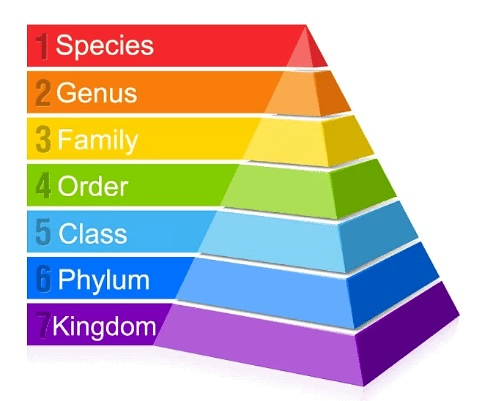

# Thank you!

This workshop was developed with support from the NSERC CREATE Computational Biodiversity Science and Services (BIOS²) training program.

{fig-align="center" width="200"}

Part 2 of this workshop is (heavily!) based on Nicholas J. Clark's Physalia course about Ecological forecasting with mvgam and brms: [nicholasjclark.github.io/physalia-forecasting-course/](https://nicholasjclark.github.io/physalia-forecasting-course/).

# Overview

This course is designed to demystify hierarchical modelling as powerful tools to model population dynamics, spatial distributions, and any non-linear relationships in your ecological data. The training will be divided into two blocks.

-   First, we will cover hierarchies in biology, data, and in models to understand what hierarchical models are, some of the forms they can take, and the fundamentals of how they work.

-   Second, we will introduce latent variable modelling as a way to explain even more of the variation in our response variables, to better disentangle the hierarchies of variation in our data.

# Learning outcomes

1.  Understand how a hierarchical model works, and how it can be used to capture nonlinear effects

2.  Understand dynamic modelling, and how latent variables can be used to capture dynamic processes like temporal or spatial autocorrelation

3.  Use the R packages mgcv and mvgam packages to build and fit hierarchical models

4.  Understand how to visualize and interpret hierarchical models with these packages

# Requirements

-   Familiarity with Generalized Additive Modelling

-   Install R & RStudio

-   Install the required packages:

```{r, eval = FALSE, include = TRUE}
install.packages(pkgs = c("dplyr",
                          "tidyr", 
                          "mvgam", 
                          "mgcv", 
                          "gratia", 
                          "marginaleffects", 
                          "corrplot",
                          "ggplot2"), 
                 dependencies = TRUE)
```

# Required packages

Let's now load them, and set the ggplot theme for all plots we make:

```{r, message = FALSE, warning = FALSE}
library("dplyr")
library("tidyr")
library("mvgam")
library("mgcv")
library("gratia")
library("marginaleffects")
library("corrplot")
library("ggplot2")

# set ggplot themes for the whole tutorial
theme_set(theme_minimal())
```

# Code

Follow along these slides with the tutorial, available at LINK HERE.

You can also download the model objects and other saved objects to lighten the computation time while following along with this presentation.

## Data

::::: columns
::: {.column width="50%"}
In this workshop, we will be analyzing time series of plankton counts (cells per mL) taken from Lake Washington in Washington, USA during a long-term monitoring study. The data are available in the `MARSS` package.

The data download and preparation steps are identical to the [steps in Nicholas J. Clark's Physalia course](https://nicholasjclark.github.io/physalia-forecasting-course/day4/tutorial_4_physalia#Lake_Washington_plankton_data).
:::

::: {.column width="50%"}
{fig-align="right"}
:::
:::::

## Data {background-video="lakevideo.mp4" background-video-loop="true" background-video-muted="true"}

```{r}
# Load the dataset
plankton_data = readRDS("saved-objects/plankton-data.rds")
```

## Data

Let's have a look at the data's structure:

```{r}
head(plankton_data)
```

## Data

Let's also plot the data to get a first look at the time series:

```{r}
ggplot(data = plankton_data, aes(x = time)) +
  geom_line(aes(y = temp), col = "black") + # Temperature in black
  geom_line(aes(y = y, col = series), lwd = .4) + # Taxa counts in color
  labs(x = "Time", 
       y = "Abundance (z-score)\n(Temperature z-score in black)", 
       col = "Group")
```

# Part 1: HGAMs {background-image="waves2.png"}

## A (very) brief introduction to GAMs

-   Definition: Generalized additive models (GAMs) are models that allow us enough flexibility to depict nonlinear relationships, without being so "black-boxy" that they become so hard to interpret. They offer a middle ground between simple and complex models.
-   Why are they relevant in ecology? A lot of relationships in ecology are not linear and this when these models come in handy,

## Nonlinear relationship

If we plot the data for one of the groups (diatoms), we see that that relationship between abundance and time is not linear.

```{r}
diatoms_data <- plankton_data[plankton_data$series == "Diatoms", ]
ggplot(diatoms_data, aes(x = time, y = y)) +
  geom_point() +
  geom_line(aes(y = y), lwd = .4) +
  labs(title = "Diatoms Data Points", x = "Time", y = "Abundance (z-score)") +
  theme_minimal()
```

## Linear model on diatoms data

If we fit a linear model on this data, we can come to the same conclusion

```{r}
diatoms_lm <- lm(y ~ time, data = diatoms_data)
```

We can plot the relationship between time and abundance using ggplot:

```{r}
ggplot(diatoms_data, aes(x = time, y = y)) +
  geom_point(color = "black") +  # Scatter points
  geom_smooth(method = "lm", color = "blue1", fill = "lightgray", se = TRUE) +  # Regression line
  labs(title = "Diatoms Data with Linear Regression Line",
       x = "Time",
       y = "Y Value") +
  theme_minimal()
```

## GAM on diatoms data

Now, if we fit a GAM on our data

```{r}
# model
diatoms_gam <- gam(y ~ s(time, bs = "cs", k = 50), data = diatoms_data)
```

We immediately see a better fit, as the spline seems to follow our data points more accurately.

```{r}
# graph
gratia::draw(diatoms_gam, rug = FALSE)
```

## What are splines?

-   Splines (also called smooth or smoother) are, just like a regular function, used to estimate the relationships between covariates and the response variable, the difference being that this relationship is nonlinear.
-   Splines are the sum of simpler functions, called basis functions.

](basis_functions.jpeg)

## What determines how "curvy" splines are?

-   In the GAM world we have a specific term for this: ✨*wiggliness*✨

-   Wiggliness refers to the degree of flexibility in the model's fitted function. It describes how much the model can fluctuate to fit the data.

-   The number of basis functions (knots) we set our model to have is the maximum wiggliness we expect our relationship to have.

](basis_weights.gif)

## Wiggliness

-   The model penalizes the wiggliness, which should shrink down our wiggliness to the right amount to match the patterns in the data.

-   If the wiggliness is too high, we risk overfitting, which results in a model that is less generalizable and more specific to this exact set of data.

-   **wiggliness** **≠ shape of the curve**

## What is a hierarchy?

### What is a hierarchy in biology?

-   It refers to the organization of organisms into levels and their inherent nestedness.

-   You're probably familiar with the taxonomic hierarchy



We find often find that nature tends to "organize" itself in hierarchies.

### What is a hierarchy in data?

We find hierarchies in data when a data item is linked to another data item by a hierarchical relationship, where we would qualify one data item to be the "parent" of the other.

```{r}
head(plankton_data) %>%

```

-   "month" is nested in "year"

-   "series" = grouping variable with 5 levels

### What is a hierarchical model?

-   Hierarchical generalised linear models, or Hierarchical models, are used to estimate linear relationships between predictors and a response variable, but impose a structure where the predictors are organized into groups.

-   The relationship between predictors dans response variable may differ across groups.

Pedersen et al. (2019)

# Part 2: DGAMs {background-image="waves2.png"}

## So far...

In Part 1, we modelled how plankton counts fluctuated through time with a hierarchical structure to understand how different groups vary through time.

We noticed a strong seasonal pattern in these fluctuations.

## First, let's go back to ecology

Before we continue, let’s “zoom out” a little and think about how our model relates to ecology.

Our model says that plankton abundances generally follow the seasonal fluctuations in temperature in Lake Washington, and that differently plankton groups fluctuate a bit differently.

All we have to explain these fluctuations is:

1.  Time

2.  Plankton groups

3.  Temperature

# Are there other factors that could explain why plankton groups vary through time during this period?

## Yes, absolutely!

There are probably unmeasured predictors that play some role here:

-   water chemistry

-   process of measuring these plankton counts through time (i.e., measurement variability or observation error)

-   What else can you think of?

## Unmeasured predictors? Can we measure them?

::::: columns
::: {.column width="50%"}
**These factors all leave an "imprint" in the time series we have here.**

And most importantly, some of these factors vary through time - they are themselves time series with their own temporal patterns.
:::

::: {.column width="50%"}
**Do we have any measured predictors to add to the model to capture the influence of these factors?**

Unfortunately, as is often the case in ecological studies, we do not have measurements of these predictors through time...
:::
:::::

## Recap

There are three important things to think about here:

1.  There are **unmeasured predictors** that influence the trend we measured and are now modelling. The signature of these unmeasured processes is in the data, but we cannot capture it with the previous model because we did not include these predictors. This is called **"latent variation"**;

2.  Each species responds to these unmeasured predictors in their own way. (This is where the **"hierarchical"** bit comes in!)

3.  These processes are not static - they are **dynamic**. Like our response variable, these unmeasured predictors **vary through time**.

## Pause: Let's talk *latents*

The definition of "latent" in the Merriam-Webster dictionary is:

> Present and capable of emerging or developing but not now visible, obvious, active, or symptomatic.
>
> OR
>
> a fingerprint (as at the scene of a crime) that is scarcely visible but can be developed for study

It can be helpful to use this definition to conceptualise latent variation in our data.

## Pause: Let's talk *latents*

As we said above, there are "imprints" of factors that we didn't measure on the time series we are modelling. These signals are present and influence the trends we estimate, but are "scarcely visible" because we lack information to detect them.

In statistical models, latent variables are essentially random predictors that are generated during the modelling process to capture correlated variations between multiple responses (species, for example).

## Pause: Let's talk *latents*

The idea is that a bunch of these latent variables are randomly generated, and they are penalized until the model only retains a minimal set of latent variables that capture the main axes of covariation between responses. (Here, it can be useful to think of how a PCA reduces the dimensions of a dataset to a minimum of informative "axes").

Each species is then assigned a "factor loading" for each latent variable, which represents the species' response to the latent variable.

## Pause: Let's talk *latents*

In a temporal model, these latent variables condense the variation that is left unexplained into a "predictor" that capture some structured pattern across responses (e.g. species' abundance trends) through time.

For example, latent variables can capture temporal autocorrelation between observations, meaning that we can tell our model to account for the fact that each observation is probably closer to neighbouring values though time (e.g. year 1 and year 2) than to a value that is several time steps away (e.g. year 1 and year 20).

## Pause: Let's talk *latents*

In a spatial model, latent variables can be applied to capture dynamic processes in space, such as spatial autocorrelation.

Similarly to the temporal model, we often make the assumption that observations that are closer in space are more similar than observations that are further apart, because ecological patterns are in part driven by the environment, which is itself spatially-autocorrelated.

## Pause: Let's talk *dynamic*

Ok, and what do we mean by "dynamic"?

A **dynamic factor model** assumes the factors that predict our response variable (i.e. biomass) evolve as time series too.

In other words, a dynamic factor model provides even more flexibility to capture the "wiggly" effects of these predictors on our response variable through time.

# Modelling multivariate time series with `mvgam`

::::: columns
::: {.column width="50%"}
{fig-align="center" width="300"}
:::

::: {.column width="50%"}
The package `mvgam` is an interface to `Stan`, which is a language used to specify Bayesian statistical models.

You could code these models directly in `Stan` if you wanted to - but `mvgam` allows you to specify the model in `R` (using the `R` syntax you know and love) and produces and compiles the `Stan` file for your model for you. Isn't that nice?
:::
:::::

# Modelling multivariate time series with `mvgam`

::::: columns
::: {.column width="50%"}
{fig-align="center" width="300"}
:::

::: {.column width="50%"}
Today, we're just scratching the surface of `mvgam`, but there are many functionalities and applications of the package that you can explore if you're interested. For example, there are blog posts about integrating phylogenetic information into your models, how to build spatial models like Joint Species Distribution Models, and more.

Check it out! [nicholasjclark.github.io/mvgam](https://nicholasjclark.github.io/mvgam/).
:::
:::::

# A little warning

In Part 2, we will build a Bayesian model but will not discuss Bayesian theory or practices in detail. To learn more:

-   [Towards A Principled Bayesian Workflow](https://betanalpha.github.io/assets/case_studies/principled_bayesian_workflow.html) by Michael Betancourt

-   [Bayes Rules! An Introduction to Applied Bayesian Modeling](https://www.bayesrulesbook.com) by Alicia A. Johnson, Miles Q. Ott, Mine Dogucu.

-   How to change the default priors in `mvgam` in [this example](https://nicholasjclark.github.io/physalia-forecasting-course/day4/tutorial_4_physalia#Multiseries_dynamics)

-   More documentation, vignettes, and tutorials can be found on the [`mvgam` site](https://nicholasjclark.github.io/mvgam/)

# Build a hierarchical model with `mvgam`

First, load the `mvgam` package and the `marginaleffects` package that we will be using to visualize the model:

```{r}
library(mvgam)
library(marginaleffects)
```

## Build a hierarchical model with `mvgam`

Our model is an attempt to estimate how plankton vary in abundance through time. Let's consider what we know about the system, to help us build this model:

1.  Seasonal variation due to temperature changes within each year that drives all plankton groups to fluctuate through time.

2.  We are also interested in how plankton abundance is changing annually, on the longer term of the time series.

3.  We know that these plankton are embedded in a complex system within a lake, and that their dynamics may be dependent for many reasons. In other words, some groups may be correlated through time, and even more complicated - these correlations may not be happening immediately. There may be *lagged* correlations between groups as well!

Let's build this model piece by piece, to capture each of these levels of variation.

## Data

First, let's split the data into a training set, used to build the model, and a testing set, used to evaluate the model.

```{r, echo = F}
plankton_data = readRDS(here::here("saved-objects/plankton-data.rds"))
```

```{r}
plankton_train <- plankton_data %>%
  dplyr::filter(time <= 112)
plankton_test <- plankton_data %>%
  dplyr::filter(time > 112)
```

## Specify the model

Next, we'll build a hierarchical GAM with a global smoother for all groups, and species-specific smooths in `mvgam`.

This will allow us to capture the "global" seasonality that drives all plankton groups to fluctuate similarly through the time series, and to capture how each group's seasonal fluctuations differ from this overall, global trend.

```{r, cache=TRUE, eval = FALSE}
notrend_mod <- mvgam(formula = 
                       y ~ 
                       # tensor of temp and month to capture
                       # "global" seasonality across plankton groups
                       te(temp, month, k = c(4, 4)) +
                       
                       # series-specific deviation tensor products
                       # in other words, each plankton group can deviate from the
                       # global trend in its own way
                       te(temp, month, k = c(4, 4), by = series),
                     
                     # set the observation family to Gaussian
                     family = gaussian(),
                     
                     # our long-format dataset, split into a training and a testing set
                     data = plankton_train,
                     newdata = plankton_test,
                     
                     # no latent trend model for now (so we can see its impact later on!)
                     trend_model = 'None',
                     
                     # compilation & sampling settings
                     use_stan = TRUE,
                     # here, we are only going to use the default sampling settings to keep the
                     # model quick for the tutorial. If you were really going to run
                     # this, you should use set the chains, samples, and burnin arguments.
)
```

```{r,include=FALSE, eval=FALSE}
saveRDS(notrend_mod, "saved-objects/notrend_mod.rds")
```

```{r,include=FALSE, eval=TRUE}
notrend_mod = readRDS(here::here("saved-objects/notrend_mod.rds"))
```

## Visualise the model

```{r}
plot_mvgam_smooth(notrend_mod)
```

This is the shared seasonal trend estimated across all groups at once.

We can see that the model was able to capture the seasonal temporal structure of the plankton counts.

## Visualise the model

We can also see how each group deviates from this global smooth (i.e. the partial effects):

```{r}
gratia::draw(notrend_mod$mgcv_model)
```

The colour shows us the strength of the partial effect of We can see that the model was able to capture some differences between each plankton group's seasonal trend and the community's global trend.

## Is the model doing a good job?

But how's the model doing, overall? Let's plot the residuals:

```{r,results='hide'}
plot_mvgam_resids(notrend_mod, series = 1)
```

There's still a lot of temporal autocorrelation to deal with in the model. Let's try to address some of this with a dynamic model!

# Let's add a dynamic trend! {background-image="waves2.png"}

# Dynamic HGAM

Let's now add a dynamic trend component to the model, to capture some of the variation that isn't captured in our previous model.

You can specify many kinds of dynamic trends with `mvgam`, but we won't go into much detail here. We want to demonstrate the power of this approach, but you will need to select the dynamic trend model that works best for you.

Here, we will use a Gaussian Process to model temporal autocorrelation in our data, which can specified as `GP` in `mvgam`.

## Dynamic HGAM

```{r, cache=TRUE, eval = FALSE}
gptrend_mod <- mvgam(formula=  
                        y ~ 
                        te(temp, month, k = c(4, 4)) +
                        te(temp, month, k = c(4, 4), by = series),
                      
                      # latent trend model
                      # setting to order 1, meaning the autocorrelation is assumed to be 1 time step.
                      trend_model = "GP",  
                      
                      # use dynamic factors to estimate the latent trends
                      use_lv = TRUE,
                      
                      # observation family
                      family = gaussian(),
                      
                      # our long-format datasets
                      data = plankton_train,
                      newdata = plankton_test,
                      
                      # use reduced samples for inclusion in tutorial data
                      samples = 100)
```

```{r,include=FALSE, eval=FALSE}
saveRDS(gptrend_mod, here::here("saved-objects/gptrend_mod.rds"))
```

```{r,include=FALSE, eval=TRUE,cache=TRUE}
gptrend_mod = readRDS(here::here("saved-objects/gptrend_mod.rds"))
```

## Inspect the model

Posterior predictive checks are one way to investigate a Bayesian model's ability to make unbiased predictions. In this check, we'll be measuring the posterior prediction error of our model.

In other words, how close are our model predictions to the expected value of Y?

## Inspect the model

```{r, fig.ncol=3, results = 'hide'}
sapply(1:5, FUN = function(x) ppc(gptrend_mod, series = x, type = 'density'))
```

These plots are pretty encouraging - our model isn't generating biased predictions compared to the observation data (black line). Our model is doing a pretty good job!

## Visualise the model

Plot the global smoother for all species over time:

```{r}
plot_mvgam_smooth(gptrend_mod)
```

## Visualise the model

Plot each species' estimated trend:

```{r, fig.ncol=3, message=F, warning=F, results = 'hide'}
sapply(1:5, function(x) plot_mvgam_trend(gptrend_mod, series = x))
```

## Visualise the model

And, importantly, let's have a look at the dynamic factors estimated by the model to capture temporal dynamics in our response data:

```{r}
plot(gptrend_mod, type = 'factors')
```

These are the famous dynamic latent variables we've been talking about. You can see that they are capturing some of the unexplained temporal variation in our model.

## Visualise the partial effects

We can plot the partial effect of each variable we included in our model, to understand how they contribute to the overall model.

```{r}
plot_predictions(gptrend_mod, condition = c("temp"), conf_level = 0.9)
```

## Visualise the partial effects

```{r}
plot_predictions(gptrend_mod, condition = c("month"), conf_level = 0.9)
```

## Visualise the partial effects

```{r}
plot_predictions(gptrend_mod, condition = c("series"), conf_level = 0.9)
```

## Rate of change

We often want to know how much our response is changing through time.

We can take a derivative of our estimated trends to get a rate of change in abundance through time.

If the derivative trend is centred on the zero line, the response variable (here, counts) were fluctuating around their mean abundance rather than declining or growing in a consistent way through time.

## Rate of change

As an example, let's look at the blue-green algae trend:

```{r, message=F, warning=F, results = 'hide'}
plot_mvgam_trend(gptrend_mod, series = 1, derivatives = TRUE)
```

It seems that these blue-green algae were pretty stable in the beginning of the time series, then declined slightly, then declined quickly around time step 100. The counts then increaased after this point.

## Rate of change

We made a slightly "hacked" version of this function to extract the derivatives:

```{r, results='hide',echo=TRUE, eval = FALSE}
source(here::here("saved-objects/custom-function.R"))
derivs = lapply(1:5, function(x) plot_mvgam_trend_custom(gptrend_mod, series = x, derivatives = TRUE))
names(derivs) = gptrend_mod$obs_data$series |> levels()

# reformatting the data for easier plotting
df = lapply(derivs, function(x) x[,-1]) |> 
  lapply(as.data.frame) |>
  lapply(pivot_longer, cols = everything()) |>
  bind_rows(.id = "Group")
```

```{r, include=FALSE, echo=FALSE, eval = FALSE}
saveRDS(derivs, here::here("saved-objects/derivs.rds"))
```

```{r, include=FALSE, echo=FALSE}
derivs = readRDS(here::here("saved-objects/derivs.rds"))

# reformatting the data for easier plotting
df = lapply(derivs, function(x) x[,-1]) |> 
  lapply(as.data.frame) |>
  lapply(pivot_longer, cols = everything()) |>
  bind_rows(.id = "Group")
```

## Rate of change

Let's look at a histogram of the derivatives to get an idea of how this group's counts changed over time, on average:

```{r, echo = FALSE}
ggplot(data = df) +
  geom_histogram(aes(x = value, fill = after_stat(x)), 
                 col = "black", linewidth = .2, bins = 19) + 
  geom_vline(xintercept = mean(df$value, na.rm = TRUE)) +
  geom_vline(xintercept = mean(df$value, na.rm = TRUE) - sd(df$value, na.rm = TRUE), lty = 2) +
  geom_vline(xintercept = mean(df$value, na.rm = TRUE) + sd(df$value, na.rm = TRUE), lty = 2) +
  theme(panel.grid.major.x = element_line()) +
  scale_y_sqrt() +
  labs(x = "Rate of change", 
       y = "Frequency", 
       fill = "Rate of change") +
  scale_fill_distiller(palette = "RdYlGn", 
                       direction = 1, 
                       limits = c(-.4,.4)) +
  coord_cartesian(xlim = c(-.4, .4)) +
  facet_wrap(~Group, ncol = 2) +
  theme(legend.position = "top")
```

## Rate of change

The median of the distribution of rates of change is \~0 for all the groups.

## Does this mean they didn't vary throughout the time series?

## Species correlations

One way to investigate community dynamics is to check out the correlations between plankton groups.

These correlations are captured with the dynamic model, which estimates unmeasured temporal processes in our data.

## Species correlations

Let's calculate and plot species' temporal correlations and plot them as a heatmap:

```{r}
# Calculate the correlations from the latent trend model
species_correlations = lv_correlations(gptrend_mod)

# prepare the matrix for plotting
toplot = species_correlations$mean_correlations
colnames(toplot) = gsub("_", "\n", stringr::str_to_sentence(colnames(toplot)))
rownames(toplot) = gsub("_", "\n", stringr::str_to_sentence(rownames(toplot)))

# plot as a heatmap
corrplot::corrplot(toplot, 
                   type = "lower",
                   method = "color", 
                   tl.cex = 1, cl.cex = 1, tl.col = "black", font = 3,)
```

## Model comparison

So, which model is best?

We will use leave-one-out comparison to compare the two models we just built: `notrend_mod` which does not have a dynamic trend, and `gptrend` which includes an autoregressive latent trend model.

This workshop isn't really about model comparison, so we will just use this approach as an example, but there are other ways you could compare these models.

## Model comparison

One way is to compare the predictive performance of the models on new data using a metric of comparison like expected log pointwise predictive density (ELPD).

```{r}
mvgam::loo_compare(notrend_mod, gptrend_mod,
                   model_names = c("No trend", "AR1 trend"))
```

The AR1 trend model performs better than the model without a dynamic trend (here, we want high - more positive- values for elpd_dif).

## Model comparison

Another way is to consider the ecological processes that influence our response variable. Which model do you think does a better job of representing the factors that cause plankton counts to vary through time?

# Wrap up {background-image="waves2.png"}

## Take home

We hope you've enjoyed this short tutorial on hierarchical generalized additive models with `mgcv` and `mvgam`.

At the end of this tutorial, we hope you now feel you understand how a hierarchical model works, and how it can be used to capture nonlinear effects. The R packages `mgcv` and `mvgam` packages are great tools to build and fit hierarchical models!

We also covered dynamic modelling, and how latent variables can be used to capture dynamic processes like temporal or spatial autocorrelation.

Can these models help you answer your research questions?

# Thank you!

Thank you to BIOS2 and Gracielle Higino, Andrew Macdonald, and Kim Gauthier-Schampaert for supporting this workshop. Special thanks to Nicholas J. Clark for helpful suggestions and for providing much of the material we used to build this workshop.

# Thank you!

If you're interested in talking more about these models, [please join our community calls](https://bios2.usherbrooke.ca/2025/02/21/hgams-working-group-community-calls/) during March and April 2025! We welcome anyone interested in GAMs, computational ecology, or eager to learn more about HGAMs to participate in the following sessions:

-   **Temporal Ecology with HGAMs**\
    When: March 7, 2025 at 1:30 PM (EST)\

-   **Spatial Ecology with HGAMs**\
    When: March 14, 2025 at 1:30 PM (EST)\

-   **Behavioural Ecology with HGAMs**\
    When: March 24, 2025 at 1:30 PM (EST)\

Join us in thinking about how we could use HGAMs to push ecological research forward!

# Thank you! {background-image="waves2.png"}
